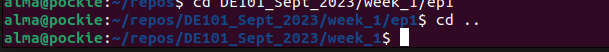

# Welcome
Welcome to class! DE101 will set you up for success in programming, whether you're continuing on to bootcamp or learning on your own.

It's designed for absolute beginners. This first day will be a gentle intro to the Python programming language and the Linux command line.

## Python
Code is a set of instructions, and there are a lot of language you can use to write it. So, why Python?

Python is:
- Widely used in data engineering.
- Supported by a large online community.
- Easy to read and debug.
- Actually pretty fun, once you get the hang of it.

## Google Colab
In bootcamp, and in the rest of this course, we'll write Python in an application called VS Code. For today we'll use Google Colab.

Colab lets you:
- Include blocks of text, called 'Markdown', throughout your code.
- Write code in cells, so you can run a single cell or a whole program.
- Start using Python without setting up a local environment.

The Python tutorial we use today is adapted from the [Data Stack Academy 5 Day Python Challenge](https://drive.google.com/drive/folders/1FxlXQNr1bgL67o5PcxNDTkRHqhiOLPRR?usp=share_link). In order to interact with the notebooks, you'll need a Google account.

Log into a Google account, then [click here](https://colab.research.google.com/drive/1d-kGaUWYM7SfM38LOOBXvV6ETQH0BQ2n?usp=sharing) to open notebook 1, where you can find lessons on the basics of Python and notebooks. Then you can keep going in [notebook 2](https://colab.research.google.com/drive/1JyqPk1WabYuac9Himwo4bnF_e8ms4-fS?usp=sharing) to learn the more advanced concept of the dictionary data structure.

## The Terminal
These instructions have you using your terminal. The terminal is how you interact with your operating system. You can open it by clicking on the terminal icon on your desktop. If you don't see one, search for how to open a terminal on whatever operating system you're using.

When you first open a terminal, it looks something like this:

...your username `@` your computer name, then `$`. This is your home directory. To see what's in it, use the command `ls` (for 'list').

You can see the files in one color, and the directories in another. To move to a directory, use `cd` (for 'change directory'). This example has a 'repos' directory, so let's move there and list what's in it:

You can use `cd` to move several directories down at once. It'll be different on your machine, but in this example the directory `DE101_Sept_2023` contains the repository for this bootcamp curriculum, matching what you're looking at here on GitHub. To move to week 1, episode 1 of the curriculum, we'd do `cd DE101_Sept_2023/week_1/ep1`:

To move back up a directory, use `cd ..`:

We'll be working with the terminal often, so play with this til your comfortable. `cd` and `ls` won't break anything. 

It can help to look at your file system on your desktop, and compare it to navigating in the terminal.

## Goals for Today
- Start learning the very basics of Python
- Get familiar with Colab
- Start navigating in the terminal.

