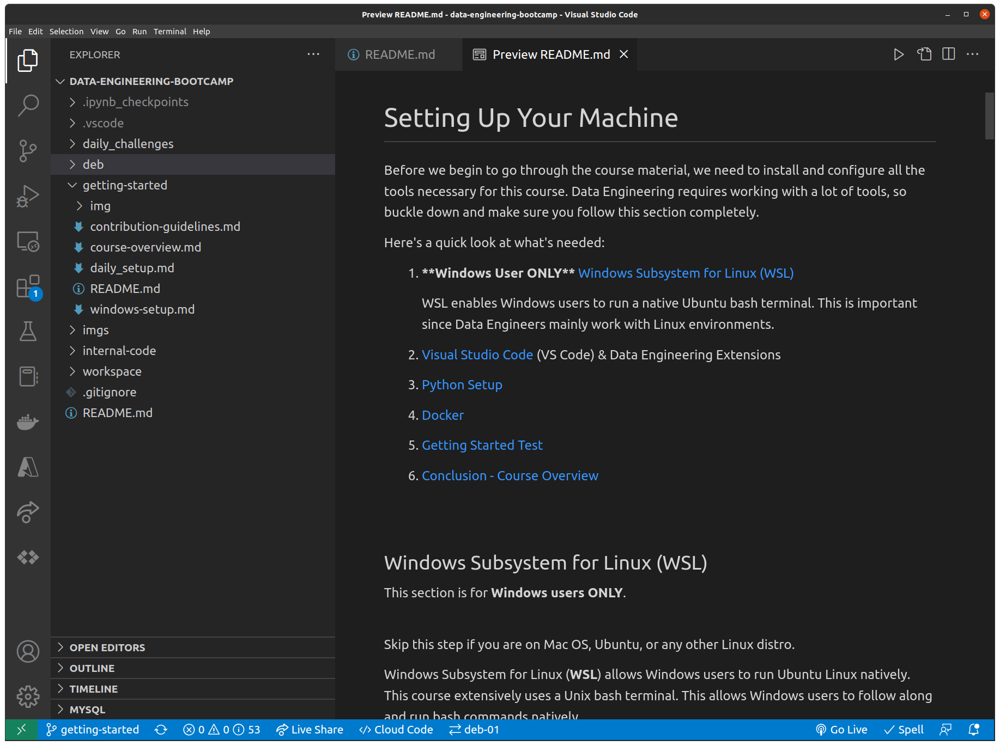
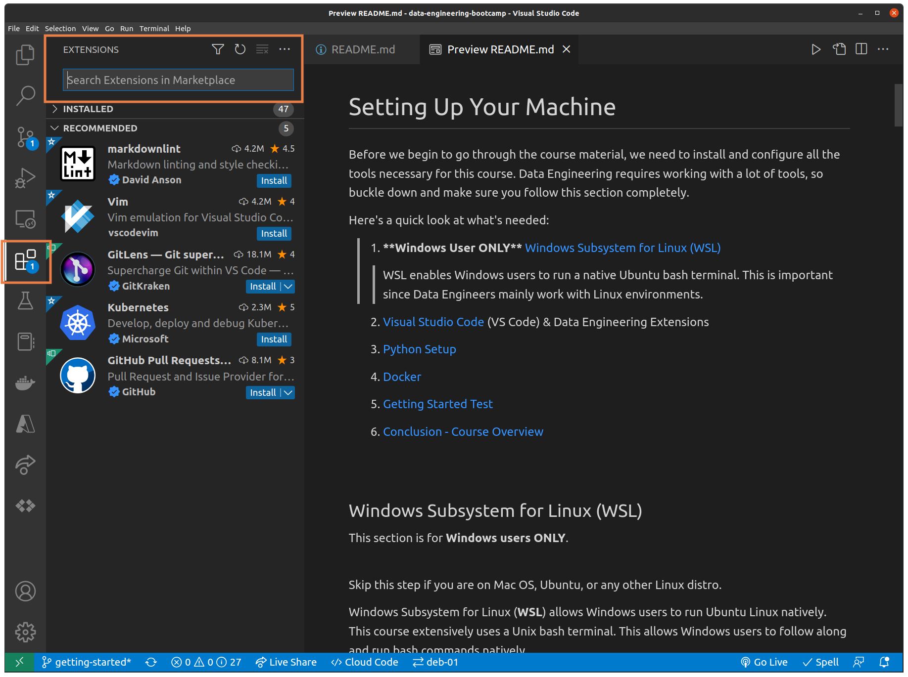
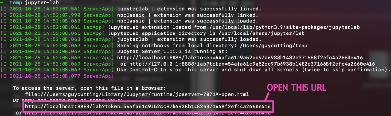
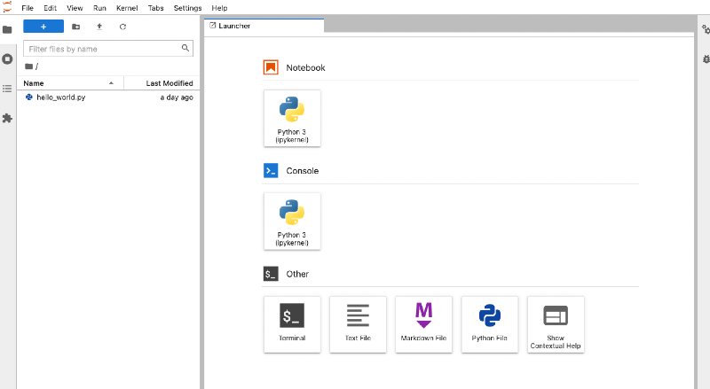

# Setup Requirements

This lesson will get your system ready for Data Stack Academy's Data Engineering Bootcamp, so please make sure you follow this section completely.

Here's a quick look at what's needed:

1. **\*\*Windows User ONLY\*\*** [Windows Subsystem for Linux (WSL)](#windows-subsystem-for-linux-wsl)

    WSL enables Windows users to run a native Ubuntu bash terminal. This is important since Data Engineers mainly work with Linux environments.

1. [Visual Studio Code](#visual-studio-code-vs-code) (VS Code) & Data Engineering Extensions

2. [Python Setup](#python)

3. [Docker](#install-docker)

4. [Getting Started Test](#getting-started-test)

5. [Conclusion - Course Overview](#conclusion---course-overview)

<br/><br/>

## The Terminal
These instructions have you using your terminal. The terminal is how you interact with your operating system. You can open it by clicking on the terminal icon on your desktop. If you don't see one, search for how to open a terminal on whatever operating system you're using.

## Windows Subsystem for Linux (WSL)

This section is for **Windows users ONLY**.

<br>

Skip this step if you are on Mac OS, Ubuntu, or any other Linux distro.

Windows Subsystem for Linux (**WSL**) allows Windows users to run Ubuntu Linux natively. This course extensively uses a Unix bash terminal. This allows Windows users to follow along and run bash commands natively.

<br/>

Follow the instructions for [Windows Subsystem for Linux (WSL) setup](windows-setup.md). After WSL installation, return here and continue the next steps on this guide.

**NOTE:** As Windows users, you will install Python on your Ubuntu WSL machine; and **NOT** your native Windows machine. You're welcome to install these on Windows as well (specially Python); but they must run on WSL.

<br/><br/>

## Mac OS Default Shell

This section is for **Mac OS users ONLY**.

<br>

The default command terminal on Mac OS uses **Z Shell**. Our course is built on a slightly different terminal called **Bash Shell**. Bash is default terminal of Linux based systems which is the ancestor of Mac OS. Mac OS has bash already installed but we must configure it to be the default terminal. 

To change your default command terminal to Bash, run:

1. Open a new command terminal window
2. Run

    ```bash
    chsh -s /bin/bash
    ```
3. Close and reopen your terminal
4. You can also do this via the **System Settings**. Please follow [this article](https://www.howtogeek.com/444596/how-to-change-the-default-shell-to-bash-in-macos-catalina/).
5. If for any reason you like to switch back to using Zsh Terminal, run:

    ```bash
    chsh -s /bin/zsh
    ```

<br><br>

## Visual Studio Code (VS Code)



This section will guide through the installation of our favorite IDE (Integrated Development Environment) called **VS Code**.

- Download and install [VS Code](https://code.visualstudio.com/download)

    **NOTE**: During the last step of the installation, make sure to check all the boxes to add VS Code to your PATH and Explorer context menu.

- **Ubuntu users (only)** can optionally install VS Code via snap. This option is preferred since it will provide automatic updates:

    ```bash
    sudo snap install code --classic
    ```

VS Code is very powerful since it provides a vast number of **extensions** to work with various development tools and libraries. These extensions make development a whole lot easier. 

### VS Code Extensions

Now, let's add the **top data engineering** extensions:

1. **Open** the Extension Tab from the left panel or hit `CTRL` + `SHIFT` + `X`

    

2.  **Search** and **install** the following extensions:

    **MUST HAVE**

    - [Python](https://marketplace.visualstudio.com/items?itemName=ms-python.python) (by Microsoft)

    - [Pylance](https://marketplace.visualstudio.com/items?itemName=ms-python.vscode-pylance) (by Microsoft)

    - [Jupyter](https://marketplace.visualstudio.com/items?itemName=ms-toolsai.jupyter) (by Microsoft)

    - [Markdown All in One](https://marketplace.visualstudio.com/items?itemName=yzhang.markdown-all-in-one) (by Yu Zhang)

    - [Docker](https://marketplace.visualstudio.com/items?itemName=ms-azuretools.vscode-docker) (by Microsoft)

    - [Live Share](https://marketplace.visualstudio.com/items?itemName=MS-vsliveshare.vsliveshare) (by Ritwick Dey)

    - [Remote Development](https://marketplace.visualstudio.com/items?itemName=ms-vscode-remote.vscode-remote-extensionpack) (by Microsoft)

    - [MySQL](https://marketplace.visualstudio.com/items?itemName=formulahendry.vscode-mysql) (by Jun Han)

    - [Cloud Code](https://marketplace.visualstudio.com/items?itemName=GoogleCloudTools.cloudcode) (by Google Cloud)

    **NICE TO HAVE**

    - [Code Runner](https://marketplace.visualstudio.com/items?itemName=formulahendry.code-runner) (by Jun Han)
    - [CSV Rainbow](https://marketplace.visualstudio.com/items?itemName=mechatroner.rainbow-csv) (by mechatroner)
    - [SQLite](https://marketplace.visualstudio.com/items?itemName=alexcvzz.vscode-sqlite) (by alexcvzz)
    - [Code Spell Checker](https://marketplace.visualstudio.com/items?itemName=streetsidesoftware.code-spell-checker) (by Street Side Software)

<br>   

### VS Code Shortcuts

There are a few important keyboard shortcuts in VS Code that are helpful to memorize:
1. `CTRL` + `SHIFT` + `V`: opens a markdown file in preview mode (html formatted)
2. `CTRL` + `SHIFT` + `P`: opens the VS Code command prompt
3. `CTRL` + `P`: opens files from command prompt
4. `CTRL` + `SHIFT` + `F`: searches the entire project
5. `CTRL` + `` ` ``: toggles the terminal
6. `F5`: starts debugging

<br>

### Opening Projects

You can use the **File** menu to open new or existing VS Code projects.

You can also open a project in VS Code from the terminal. This is sometimes useful when you are navigating between project folders and need to quickly view the code in your working directory in VS Code. This works out of the box on Linux and Windows; Mac users follow [this additional step](https://code.visualstudio.com/docs/setup/mac#_launching-from-the-command-line). Then, you can run:

```bash
code .
``` 

and VS Code will open a window with the contents of the current directory.

<br>

### Viewing Markdown Files

To read the Markdown instructions files:
1. Open the markdown `.md` file
2. Press `CTRL` + `SHIFT` + `V` 

This renders the markdown file as **HTML** which is a lot easier to read and follow.

<br/><br/>

## Python

<br/>

**NOTE**: WSL users must install python under their WSL Ubuntu terminal. Follow the Ubuntu instructions below. You can additionally install on Windows itself if you prefer to have both.

<br/>

This course is developed for **Python version 3.7**. 

Even though _Python 3.9_ and _3.10_ are currently available, a lot of the dependency packages in this course don't support them. You are free to install other versions (ie: 3.9 or 3.10) but you must have a working version of **python 3.7**. In fact, it's very common to have multiple versions of Python installed.

Check to see if you already have Python installed

```bash
python3 -V
```

- You can skip this section if you see any version that starts with `3.7.*` (here we have 3.7.13).  
- Don't worry if you see another version or nothing at all. That just means we need to install it.

Follow the instructions below if you do **NOT** have Python 3.7 installed. 

<br/>


We have included installation steps for Mac OS, Ubuntu, and WSL (Windows) below but if you run into issues there are alternative ways:

- The easiest way is to Google "install python3.7 <your operating system>" for example _"install python3.7 ubuntu 20.04"_ or _"install python3.7 Mac OS X"_. Follow the instructions that you find for you operating system.
- You can download python3.7 installers from [python.org](python.org). If you decide to go this way, download and install the highest 3.7 version from python.org.

<br/>

### Ubuntu and Windows WSL

**NOTE:** Windows users should run the python installation steps below from their WSL Ubuntu machine.

<br>

First add the *deadsnake* ppa repos which contain Python3.7 binaries:

```bash
sudo apt-get update
sudo apt-get install software-properties-common
sudo add-apt-repository ppa:deadsnakes/ppa
sudo apt-get update
```

Now, install Python 3.7 along with pip and virtualenv:

```bash 
# install python3.7, pip, and python virtualenv
sudo apt-get install python3.7 python3-pip python3-venv

# upgrade pip and other essential python packages
python3.7 -m pip install --upgrade setuptools pip virtualenv
```

Some users will need to add `pip` to their $PATH. **Skip** this step if you can successfully run this command in a terminal: `pip3 --version`

```bash
printf "\n\n# adding pip to \$PATH\nexport PATH=\$PATH:/home/${USER}/.local/bin" >> ~/.bashrc
source ~/.bashrc
```

### Mac OS

Use brew to install python 3.7, pip, and virtualenv:

```bash
brew install python3.7

# install pip (python package manager)
curl https://bootstrap.pypa.io/get-pip.py -o get-pip.py
python3.7 get-pip.py

# upgrade pip and other essential python packages
python3.7 -m pip install --upgrade setuptools pip virtualenv
```

<br/><br/>

## Jupyter Notebook

Many of the code examples for this course are in [Jupyter notebook](https://ipython.org/ipython-doc/3/notebook/nbformat.html). Jupyter notebooks have become the standard for interactive, collaborative programming and reproducible research. Nearly all data analysts, scientists, and engineers use these notebooks regularly as part of their work.

Installing Jupyter (with pip) is easy and the same across all systems. Simply run:

```bash
pip install jupyterlab
```

Jupyter Notebook uses the file extension of `.ipynb`. We call these file **notebooks**. You work with notebooks in either one of the two options below:
1. [VS Code](#working-with-vs-code)
2. [Jupyter-lab browser-based UI](#working-with-jupyter-lab)

### Working with VS Code

The easiest way to work with notebooks is directly inside VS Code. Make sure you have the VS Code [Jupyter](https://marketplace.visualstudio.com/items?itemName=ms-toolsai.jupyter) extension installed and enabled. Then, simply open `ipynb` files in VS Code. You will later learn [how to run notebooks](/deb/ch1/ep1/README.md#working-with-notebooks-in-vs-code) inside VS Code.

### Working with Jupyter-lab

**NOTE:** This section is completely **optional** for your information only. You can skip this.

Jupyter comes with its own browser-based interface which is often useful. This allows  To run Jupyter Lab:

```bash
jupyter-lab
```

When you run this command, the last line will give you a **URL** to open:



Copy the URL and open it in your browser:



Now, you can use the File menu to open any `ipynb` notebooks in your project. For more details, see the [official Jupyter installation guide](https://jupyter.org/install).

<br/><br/>

## Install Docker

Docker is a containerization tool. It enables various software such as Databases and Big Data applications to run on your machine (as containers) without going through complex installation processes. Docker is also one of the main technologies used behind the scenes to build Cloud services. We won't be using Docker in DE101, but you'll need it for bootcamp.

<br/>

**NOTE:** **WSL** users should follow the Docker installation for Windows using **"WSL 2 backend"**. 

<br/>

Follow the [**Docker Installation**](https://docs.docker.com/get-docker/) guide.

<br/>

In order to test your docker install, open a terminal and run:

```bash
docker run hello-world
```

This command should execute without any issues.

<br/><br/>

## Install Git CLI

Let's make sure we have `git` cli installed and properly working. Please follow the instructions below for your OS:

## Windows WSL and Ubuntu

**Windows WSL** must have the git cli installed and working on their Ubuntu WSL machine. Please follow these instructions there.

Open a command terminal and run the commands below:

```bash
sudo apt update
sudo apt install git

git --version
```

## Mac OS

The easiest is probably to install the Xcode Command Line Tools. On Mavericks (10.9) or above you can do this simply by trying to run git from the Terminal the very first time:

```bash
git --version
```

If you don’t have it installed already, it will prompt you to install it.

If you want a more up to date version, you can also install it via a binary installer. A macOS Git installer is maintained and available for download at the Git website, at [https://git-scm.com/download/mac](https://git-scm.com/download/mac).


<br><br>

## Getting Started Test

This section checks to see if you have successfully finished setting up your environment. If everything is working correctly, you should be able finish this section without any issues. **Please** check with your instructor if you have any issues. 

Note: We anticipate most issues to arise from installing WSL. That's normal. 

Open a new bash terminal (or WSL terminal on Windows) and execute the commands below. **Copy** and execute each command **line-by-line**:

```bash
# --------------------------------
# check bash terminal
# this is a test for Mac OS and WSL users
num=7; if (test $num -gt 5); then echo "bash-test: ok"; else echo "bash-test: failed"; fi


# --------------------------------
# test git 
git --version


# --------------------------------
# test python
python3.7 -V
pip3 -V
python3.7 -c "print('python-test: ok')"


# --------------------------------
# test python virtualenv (venv)
python3.7 -m venv venv
# if the above command doesn't work; then try this:
virtualenv -p python3.7 venv

# activate your venv, test it, deactivate it, and then remove it
source venv/bin/activate
pip install pandas
python -c 'import pandas as pd; print(pd.DataFrame(data={"venv-test": ["ok"]}))'
deactivate
rm -rf venv


# --------------------------------
# test docker
docker version
docker run hello-world
docker system prune -f 


# --------------------------------
# test vs code
code .

```

<br/><br/>

Whew! Nice work.
