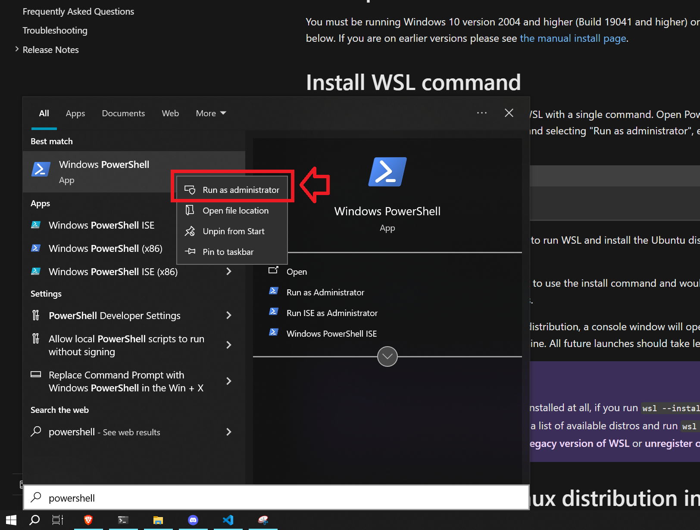
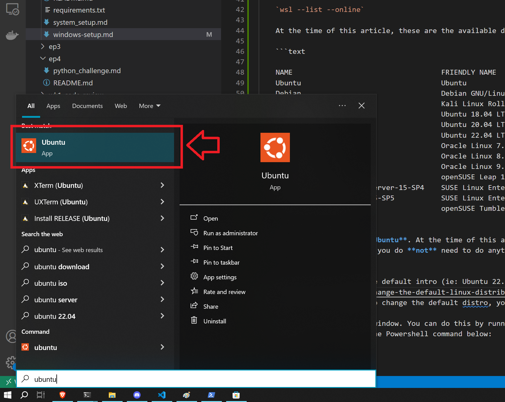
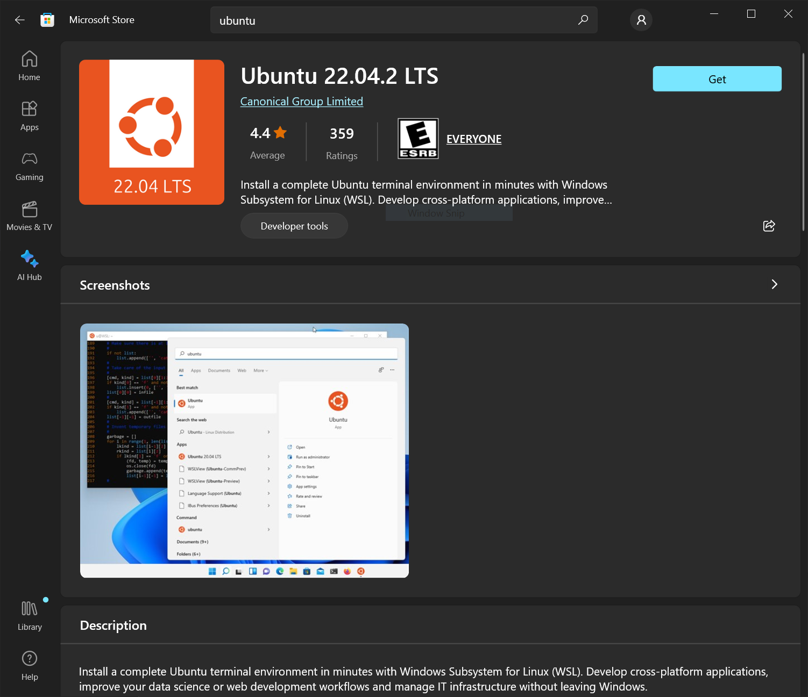
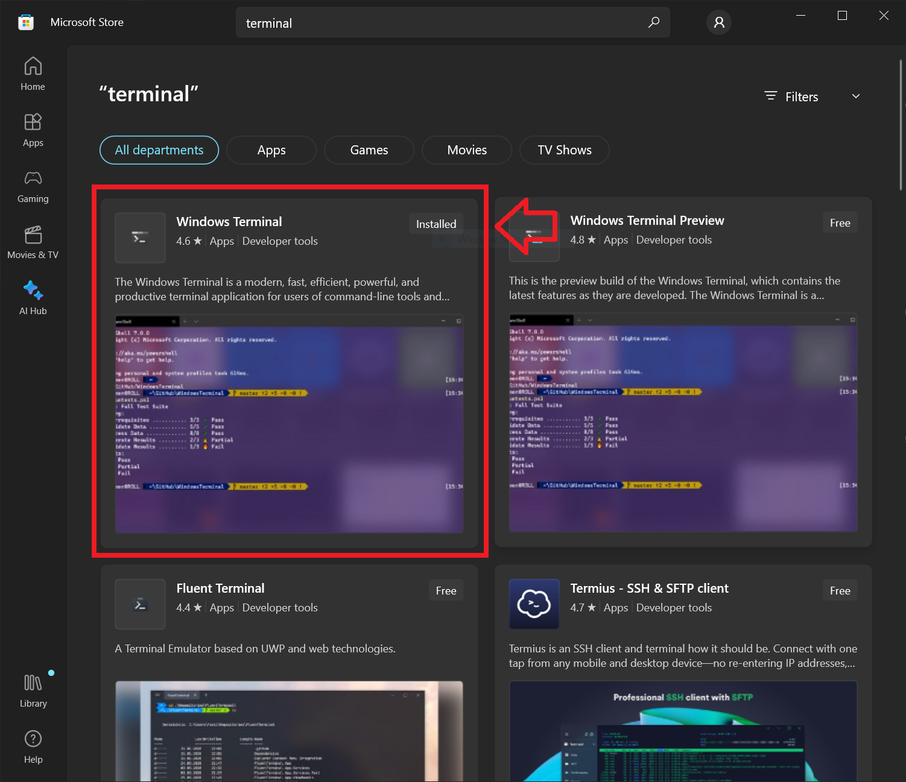
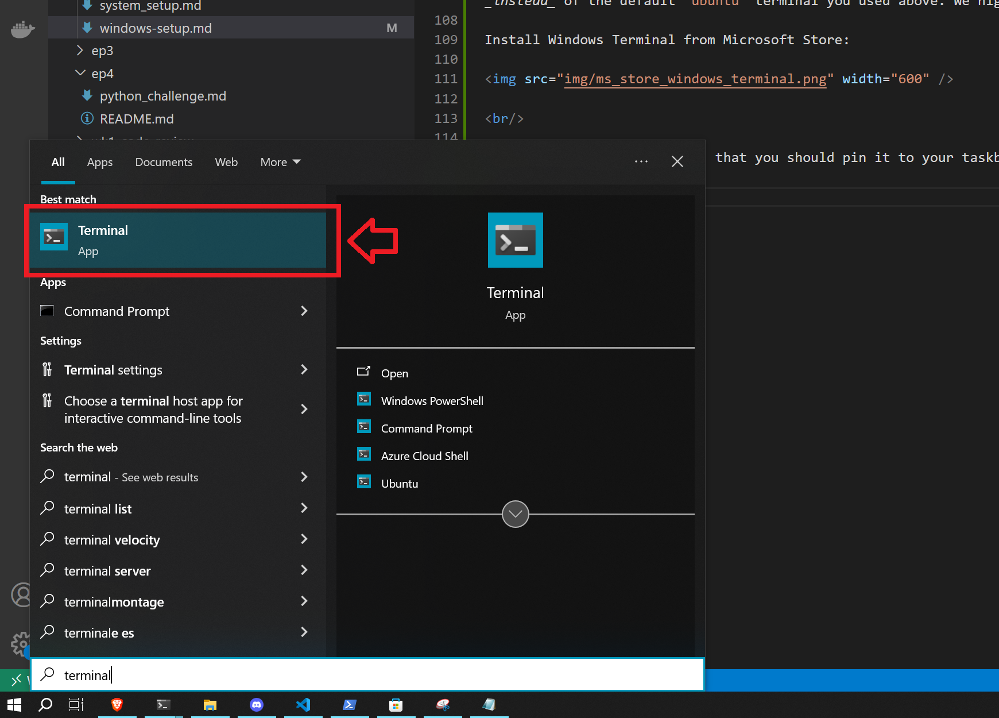
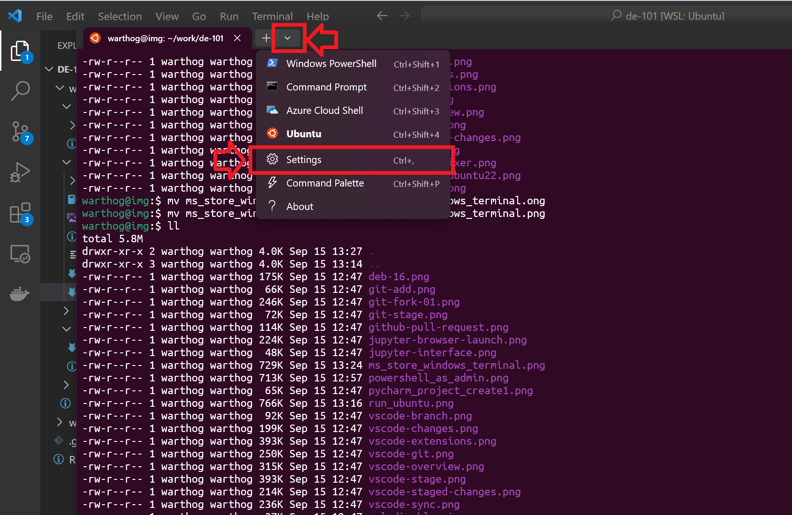
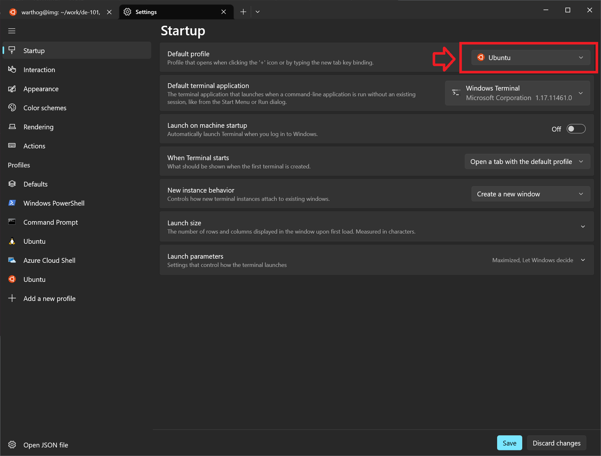

# Windows Subsystem for Linux (WSL) Setup

Windows Subsystem for Linux (**WSL**) allows Windows users to run Ubuntu Linux natively. This course extensively uses a Unix bash terminal. This allows Windows users to follow along and run bash commands natively.

<br/>

## Install WSL 2

<br/>

Follow Microsoft official documentation to [**install WSL 2**](https://docs.microsoft.com/en-us/windows/wsl/install).

While you follow the Microsoft instructions keep these notes in mind:

<br/>

**NOTE:**
>**UPGRADE WINDOWS FIRST**
>
>Most issues regarding WSL installation arise from older versions of Windows. If you are running a Windows Build lower than **19041**, before enabling WSL 2 you must **upgrade** Windows using **Windows Update Assistant**. To find your Windows Build info, hit the Windows key and type _"System Information"_. (At the time of this writing, the latest build is 10.0.19041)

<br/>

> **Window 11**
> 
>Some users are reporting issues with WSL when upgrading to Windows 11, with no clear fix yet. The links below might help you troubleshoot the problem. If you experience this, please let the instructor know, and we can take a look at your specific installation:
>- [WSL File System Error # 1](https://github.com/microsoft/WSL/issues/7435)
>- [WSL File System Error # 2](https://github.com/microsoft/WSL/issues/5456)

<br/>

1. WSL installation is made simple now (as it was very difficult before) with running a single **Powershell** command:

    `wsl --install`

2. Make sure that you start Powershell in **Administrator** mode:

    

    <br/>

3. In this class, we use **Ubuntu**. At the time of this article, this is the **default** linux distro (distribution) installed by WSL. Therefore you do **not** need to do anything else. Feel free to skip the next step below.

    <br/>

4. If you like to change the default intro (ie: Ubuntu 22.04), you can follow the [these steps](https://learn.microsoft.com/en-us/windows/wsl/install#change-the-default-linux-distribution-installed). Make sure that you do these steps from running the `ubuntu` app and **NOT** Powershell (as before)

    


<br/><br/>

## Install Ubuntu 22.04

Once you have WSL installed, you can install Ubuntu 22.04, which is our recommended Linux distribution. 

Open the Microsoft Store App: **[Install Ubuntu from the Microsoft store](https://www.microsoft.com/store/productid/9PN20MSR04DW?ocid=pdpshare)**



<br/>

Once you have Ubuntu installed on your WSL, you should update your Ubuntu install:

1. Start an **Ubuntu** terminal from the **Start Menu** 

    

2. You will be prompted to choose a **root** password. Make sure to **remember** this. You do not have a chance to reset this if you forget.

3. Run the following:

    ```bash
    sudo apt update
    sudo apt -y upgrade
    ```

**NOTE:** You MUST first update/upgrade Ubuntu before you can properly install and run Python.

<br/>

## Accessing Files

Because Ubuntu uses a file structure, it's hard to find where your WSL Ubuntu files live under you actual Windows machine. To open the content of any Ubuntu folder, you can simple run the following command:

```bash
explorer.exe .
```

This will open a Windows Explorer windows that points to your current Ubuntu directory.

<br/>

In reverse, your Windows files can be access from Ubuntu under:

```bash
cd /mnt/c
ls -l
```

This will list the content of your C Drive.


## Install Windows Terminal

This step is optional; but by far the best command line interface on Windows is **Windows Terminal**. You can use this _instead_ of the default `ubuntu` terminal you used above. We highly recommend installing this app.

1. Install Windows Terminal from Microsoft Store:

    

    <br/>

1. You'll use this app so much, that you should pin it to your taskbar 😉

1. You can run it by typing `terminal` in your Start menu:

    

    <br/>
    
1. Be sure to drop down the settings tab:

    

1. And set **`Ubuntu`** as your default terminal:

    


<br/><br/>
Enjoy **commanding** 😎💂‍♀️💂‍♂️

