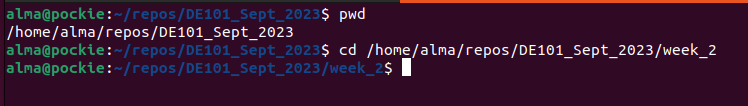
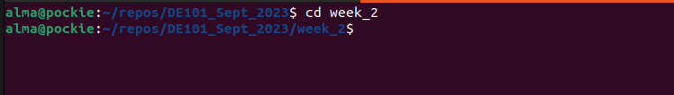
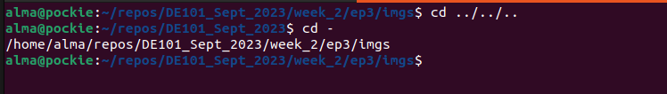

# Command Line

_"Graphical user interfaces make easy tasks easy, while command line interfaces make difficult tasks possible."_     -William Shotts, 'The Linux Command Line'

Before we dive back into Python, let's learn some command-line interface (CLI) tools. The command-line lets your search and navigate your file system, change the kinds of permissions on files, configure your environment, and much more. We've already used it for Git and GitHub. Here, we'll learn other common commands. 

The commands described here are standard on any Linux-flavored OS, but they might not all be available on every system, depending on your distribution. Because Mac OS is based on Free BSD, most (though not all) standard Linux commands are available from a Mac OS terminal.

You can find out more about these commands by looking up their man (manual) pages with `man <command_name>` . You're also encouraged to Google commands for more info. For example, here's a [link](https://www.geeksforgeeks.org/find-command-in-linux-with-examples/?ref=lbp) for working with the `find` command.

Test each of the commands below, and observe the output. If a command is stalling out, you can stop it by typing `Ctrl + c`.

> Nothing in this lesson is dangerous, but use the commands to move or remove files with caution. When you get more advanced, be careful about terminal commands you find on the internet; some of them can delete a lot of information.

 ## Navigation
We've already learned how to use `cd` to change directories.

You can traverse the file tree in two ways:
- Absolute path, which starts at the root and lists every directory til the destination, or
- Relative path, which starts from the directory you're currently in.

To get the absolute path to the directory you're in (the present working directory), use `pwd`.

Here's an example of using an absolute path (silly here, but there are cases where it's useful):

...and an example using relative path:

Sometimes in a code file you'll see a path written with `./` at the beginning. That means, "start in the directory containing this file". If you look at the raw Markdown for the README.md file we're in right now, you'll see paths like `./imgs/relative_path.png`, meaning, "start in the `ep3` directory containing this `README`, then go to the `imgs` folder that's also there". Check out the folder for this episode in VSCode or GitHub to see what it contains.

`cd` has a few useful shortcuts:

`cd -` changes the directory to the previous working directory. Note that this is previous like "most recent", not like "the one above it in the file tree". For illustration:

`cd ~` takes you back to the home directory.

## Contents of a Directory
You've already used `ls` to list the contents of the directory your currently in. It has many additional options, but we'll just look at two.
    
`ls -l` lists your files in 'long format', which contains lots of information that will be useful as you advance. For example:

Let's break it down:

|Field | Meaning |
|----|----|
|drwxrwxr-x|The first character is the type of file: 'd' is a directory, '-' is a file. The rest are permissions: 'r' for 'read', 'w' for 'write', 'x' for 'execute'. The first three are for the file's owner, the middle three are for members of the file's group, and the last three are for everyone else. Permissions are an advanced topic that we'll visit in bootcamp.|
|4|Number of hard links to the file, including itself and its parent directory|
|alma|The file's owner|
|alma|The group that owns the file|
|4096|The size of the file, in bytes|
|Sep 13 17:34|When the file was last modified|
|ep1|The file's name|

`ls -a` lists all files. Filenames that begin with a `.` are normally hidden, usually because they should only be modified with caution. 

> Note: Filenames in Linux are case sensitive. Use an underscore or hyphen to separate words, instead of whitespace, which will cause the words to be read as separate names in the terminal. For example, "hi_there.txt" is better than "hi there.txt"

`less <filename>` shows the contents of a file. Use the arrow keys to scroll, or `q`` to quit. 

## Making, Moving, and Removing Files and Directories
`mkdir <dirname>` makes a new directory in the directory you're currently in. You can use `mkdir` followed by several folder names, and they'll all be created at once.

`mv <itemname1> <itemname2>` moves `<itemname1>` into `<itemname2>`, if `<itemname2>` exists. Otherwise, `<itemname1>` gets renamed as `<itemname2>`. You can't move the directory you're currently in.

`touch <filename>` creates a file in the directory you're currently in.

`rm <itemname>` deletes the item. Careful! You won't get a warning, and it can't be reversed. `rm` has some useful options:

|Short name|Long name|Purpose|
|----|----|----|
|-i|--interactive|Prompt the user for confirmation before deleting|
|-r|--recursive|This has to be used if you're deleting a directory that contains subdirectories|
|-v|--verbose|Show info about the deletion|

You can use several options at once, like this: `rm -rv <dirname>`

### Exercise
- In your terminal, navigate to the week_2/ep3 folder
- Use `mkdir` to create two new directories, `thing1` and `thing2`
- In `thing2`, use `touch` to create a file called `story.txt`
- Use `mv` to move `thing2` into `thing1`
- `ls` the contents of `thing1` to make sure that worked
- Recursively remove `thing1` and its contents

- Hint: for each step, make sure you're in the right directory

## Writing to a File

`echo "hello"` will just print a message to the console.

`echo "hello" > <filename>` uses the redirect symbol (`>`) to write the text after the `echo` command to a file. If there's already something in the file, it will be overwritten. 

Use the redirect-append symbol (`>>`) to add text to the end of a file, instead of overwriting what's there. For example, `echo " world" >> <filename>` 

## Some Other Useful Commands
     
`nano <itemname>` Nano is an editor that lets you create and edit a file. See the [beginner's guide to nano](https://itsfoss.com/nano-editor-guide/).
    
`diff <itemname1> <itemname2>` compares files, and shows where they differ.
    
`wc <itemname>` tells you how many lines, words, and characters there are in a file
    
`whoami` returns your username. Sounds useless, but isn't. You may need to find out who it is who forgot to log out somewhere, and make sure *you* have logged out.

`ps` lists running processes. It contains lots of information about them, including the process ID, which you need if you have to kill a process. If you're computer's running weirdly slow, this may show you what's slowing it down.

`kill <PID>` kills (ends) the processes with the ID you gave. If the process doesn't 'die' properly, use the option -9. But attempt without that option first, because it doesn't give the process a chance to finish possibly important business before dying. 
    
`pkill <PNAME>` kills a particular process using the process name.

`du <itemname>` shows the disk usage of the files and directories in itemname (without argument the current directory is used). du -s gives only a total.
    
`df` shows a list of disks on the system and the amount of disk space used

## Goals for Today
- Learn more about using the command line
