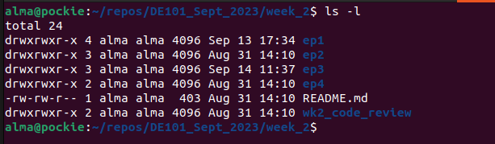

# Command Line

_"Graphical user interfaces make easy tasks easy, while command line interfaces make difficult tasks possible._     -William Shotts, 'The Linux Command Line'

Before we dive back into Python, let's learn some command-line interface (CLI) tools. The command-line lets your search and navigate your file system, change the kinds of permissions on files, configure your environment, and much more. We've already used it for Git and GitHub. Here, we'll learn other common commands. 

The commands described here are standard on any Linux-flavored OS, but they might not all be available on every system, depending on your distribution. Because Mac OS is based on Free BSD, most (though not all) standard Linux commands are available from a Mac OS terminal.

You can find out more about these commands by looking up their man (manual) pages with `man <command_name>` . You're also encouraged to Google commands for more info. For example, here's a [link](https://www.geeksforgeeks.org/find-command-in-linux-with-examples/?ref=lbp) for working with the `find` command.

Test each of the commands below, and observe the output. If a command is stalling out, you can stop it by typing `Ctrl + c`.

> Nothing in this lesson is dangerous, but use the commands to move or remove files with caution. When you get more advanced, be cautious about terminal commands you find on the internet; some of them can delete a lot of information.

 ## Navigation
We've already learned how to use `cd` to change directories.

You can traverse the file tree in two ways:
- Absolute path, which starts at the root and lists every directory til the destination, or
- Relative path, which starts from the directory you're currently in.

To get the absolute path to the directory you're in ("present working directory"), use `pwd`.

Here's an example of using an absolute path (silly here, but there are cases where it's useful):

...and an example using relative path:

Sometimes in a code file you'll see a path written with `./` at the beginning. That means, "start in the directory containing this file. If you look at the raw Markdown for the README.md file we're in right now, you'll see paths like `./imgs/relative_path.png`, meaning, "start in the `ep3` directory containing this `README`, then go to the `imgs` folder that's also there. Check out the folder for this episode in VSCode or GitHub to see what it contains.

`cd` has a few useful shortcuts:

`cd -` changes the directory to the previous working directory. Note that this is previous like "most recent", not like "the one above it in the file tree". For illustrations:

`cd ~` takes you back to the home directory.

## Contents of a Directory
You've also already used `ls` to list the contents of the directory your currently in. It has many additional options, but we'll just look at two.
    
`ls -l` lists your files in 'long format', which contains lots of information that will be useful as you advance. For example:

Let's break it down:

|Field | Meaning |
|----|----|
|drwxrwxr-x|The first character is the type of file: 'd' is a directory, '-' is a file. The rest are permissions: 'r' for 'read', 'w' for 'write', 'x' for 'execute'. The first three are for the file's owner, the middle three are for members of the file's group, and the last three are for everyone else. Permissions are an advanced topic that we'll visit in bootcamp.|
|4|Number of hard links to the file, including itself and its parent directory|
|alma|The file's owner|
|alma|The group that owns the file|
|4096|The size of the file, in bytes|
|Sep 13 17:34|When the file was last modified|
|ep1|The file's name|

`ls -a` lists all files. Filenames that begin with a `.` are normally hidden, usually because they should only be modified with caution. 

> Note: filenames in Linux are case sensitive. Use an underscore or hyphen to separate words, instead of whitespace, which will cause the words to be read as separate names in the terminal. 

## Changing and Moving Files

    
`more <filename>` - shows the first part of a file, just as much as will fit on one screen. Just hit the space bar to see more or `q`` to quit. 
    
`nano <filename>` - Nano is an editor that lets you create and edit a file. See the [beginner's guide to nano](https://itsfoss.com/nano-editor-guide/).
    
`mv <filename1> <filename2>` - moves a file (i.e. gives it a different name, or moves it into a different directory (see below)
    
`cp <filename1> <filename2>` - copies a file
    
`rm <filename>` - removes a file. It is wise to use the option rm -i, which will ask you for confirmation before actually deleting anything. You can make this your default by making an alias in your .cshrc file.
    
`diff <filename1> <filename2>` - compares files, and shows where they differ
    
`wc <filename>` - tells you how many lines, words, and characters there are in a file
    
`chmod [options] <filename>` - lets you change the read, write, and execute permissions on your files. The default is that only you can look at them and change them, but you may sometimes want to change these permissions. For example, chmod o+r filename will make the file readable for everyone, and chmod o-r filename will make it unreadable for others again. Note that for someone to be able to actually look at the file the directories it is in need to be at least executable. See [this guide to Linux permissions](https://opensource.com/article/19/6/understanding-linux-permissions) for more details.

 

## Directories
Directories are used to group files together in a hierarchical structure. It's basically a folder. Here are some commands for navigating directory structure.

`mkdir <dirname>` - make a new directory

`cd <dirname>`  - change directory. Your working directory (where you are) will change, and you will see the files in that directory when you do `ls`. You always start out in your home directory, and you can get back there by typing `cd` without arguments. `cd ..` will get you one level up from your current position. `cd ../..` will get you two levels up from your current position, and so on. You don't have to walk along step by step - you can make big leaps or avoid walking around by specifying pathnames.
    
`pwd` - tells you where you currently are. 

 

## File Compression
`gzip <filename>` --- compresses files, so that they take up much less space. Usually text files compress to about half their original size, but it depends on the size of the file and the nature of the contents. There are other tools for this purpose, too (e.g. compress), but gzip usually gives the highest compression rate. Gzip produces files with the ending '.gz' appended to the original filename.
        
`gunzip <filename>` - uncompresses files compressed by gzip.
        
`gzcat <filename>` - lets you look at a gzipped file without actually having to gunzip it (same as gunzip -c). 

`tar -xzvf` - untar a .tar file

 

## Finding things
`find` - find files anywhere on the system. This can be extremely useful if you've forgotten in which directory you put a file, but do remember the name. In fact, if you use ff -p you don't even need the full name, just the beginning. This can also be useful for finding other things on the system, e.g. documentation.
    
`grep <string> <filename(s)>` - looks for the string in the files. This can be useful a lot of purposes, e.g. finding the right file among many, figuring out which is the right version of something, and even doing serious corpus work. grep comes in several varieties (grep, egrep, and fgrep) and has a lot of very flexible options. 

`grep` takes arguments as regular expressions ("regex"), which matches patterns. We recommend the site [https://regex101.com/](https://regex101.com/) to learn more about regex.

 

## About your (electronic) self
`whoami` - returns your username. Sounds useless, but isn't. You may need to find out who it is who forgot to log out somewhere, and make sure *you* have logged out.

`ps` - lists running processes. Contains lots of information about them, including the process ID, which you need if you have to kill a process. 

`ps aux | grep chrome` - list processes and filter to only running chrome processes

`kill <PID>` --- kills (ends) the processes with the ID you gave. Get the ID by using `ps``. If the process doesn't 'die' properly, use the option -9. But attempt without that option first, because it doesn't give the process a chance to finish possibly important business before dying. 
    
`pkill <PNAME>` - kill a particular process using the process name

`du <filename>` - shows the disk usage of the files and directories in filename (without argument the current directory is used). du -s gives only a total.
    
`df` - shows a list of disks on the system and the amount of disk space used

 

## Working with file content 

`echo "hello"` - print a message to the console

`echo "hello" > test.txt` - use the redirect symbol (`>`) to direct the output of `echo` command into a file

`cat test.txt` - display the content of test.txt

`echo " world" >> test.txt` - use the redirect-append symbol (`>>`) to append the output of `echo` command into an existing file

`cat test.txt` - display the content of test.txt

## Goals for Today
- Learn how to navigate your computer's command line
